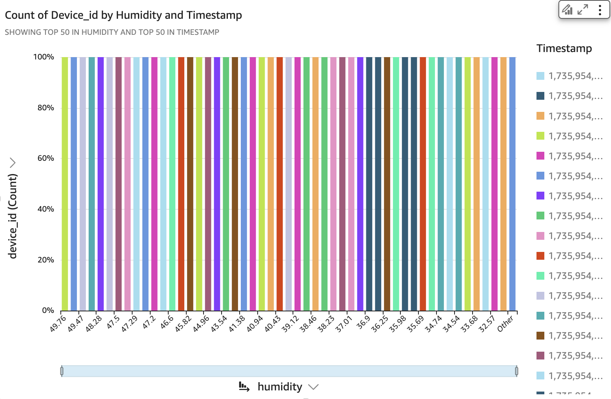

# IoT Monitoring on AWS 🚀

## 🌟 Overview

This project demonstrates a robust IoT monitoring system leveraging *AWS services* and Python. It includes:
- Simulated IoT data generation.
- Data visualization with pre-built charts.
- Metadata for IoT devices in JSON format.
- Sample IoT data for testing and extension.

The project serves as an excellent starting point for building IoT applications with AWS IoT Core, enabling real-time monitoring, analysis, and visualization.

---

## 📂 Repository Contents

plaintext
iot-monitoring-aws/
├── device-68.json            # Metadata for IoT Device 68
├── device-71.json            # Metadata for IoT Device 71
├── humidity-chart.png         # Pre-built chart for humidity trends
├── sample_iot_data.csv        # Sample IoT dataset for testing
├── simulate_iot_data.py       # Python script for simulating IoT data
├── temperature-chart.png      # Pre-built chart for temperature trends

---

## 🔧 Getting Started

### Prerequisites

1. *Python 3.x*: Ensure Python is installed on your machine. You can download it from [python.org](https://www.python.org/).
2. Install the boto3 library to interact with AWS services (if extending the project to AWS):
   bash
   pip install boto3
   
3. *AWS CLI (Optional)*: If you plan to extend this project to integrate with AWS IoT Core, install and configure the AWS CLI:
   - Install: [AWS CLI Installation Guide](https://docs.aws.amazon.com/cli/latest/userguide/install-cliv2.html)
   - Configure:
     bash
     aws configure
     

---

### 🚀 How to Run the Project

1. *Clone the Repository*:
   bash
   git clone https://github.com/MCShravan/iot-monitoring-aws.git
   cd iot-monitoring-aws
   

2. *Simulate IoT Data*:
   Run the provided script to simulate IoT data for temperature and humidity:
   bash
   python simulate_iot_data.py
   

3. *Analyze the Data*:
   Use the pre-built charts for visualizing IoT data trends:
   - *Temperature Trends*: temperature-chart.png
   - *Humidity Trends*: humidity-chart.png

4. *Explore IoT Devices*:
   Review the JSON files (device-68.json, device-71.json) for IoT device metadata.

---

## 📊 Data Visualization

### Temperature Chart:

### Humidity Chart:

---

## 🌐 Key Features
- *IoT Data Simulation*: Python script to generate realistic IoT data.
- *Data Visualization*: Pre-built charts for understanding trends.
- *Device Metadata*: JSON files for managing IoT device configurations.
- *AWS Integration Ready: Extend the project to integrate with **AWS IoT Core*.

---

## 📜 License
This project is licensed under the Apache License. See the LICENSE file for more details.

---

## ✨ Acknowledgments
Thanks to AWS IoT services and open-source Python tools for enabling this project.
